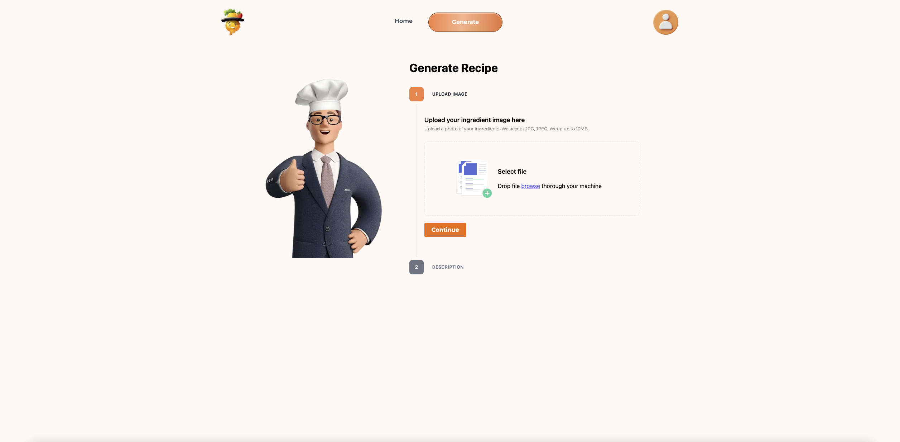

<!-- Improved compatibility of back to top link: See: https://github.com/othneildrew/Best-README-Template/pull/73 -->
<a name="readme-top"></a>
<!--
*** Thanks for checking out the Best-README-Template. If you have a suggestion
*** that would make this better, please fork the repo and create a pull request
*** or simply open an issue with the tag "enhancement".
*** Don't forget to give the project a star!
*** Thanks again! Now go create something AMAZING! :D
-->


<!-- PROJECT SHIELDS -->
<!--
*** I'm using markdown "reference style" links for readability.
*** Reference links are enclosed in brackets [ ] instead of parentheses ( ).
*** See the bottom of this document for the declaration of the reference variables
*** for contributors-url, forks-url, etc. This is an optional, concise syntax you may use.
*** https://www.markdownguide.org/basic-syntax/#reference-style-links
-->
[![Contributors][contributors-shield]][contributors-url]
[![Forks][forks-shield]][forks-url]
[![Stargazers][stars-shield]][stars-url]
[![Issues][issues-shield]][issues-url]


<!-- PROJECT LOGO -->
<br />
<div align="center">
  <a href="https://github.com/othneildrew/Best-README-Template">
    
  </a>

  <h3 align="center">Rizzipe</h3>

  <p align="center">
    A web app that is able to generate recipe based on ingredient images
    <br />
    <a href="https://github.com/y1xing/rizzipe_app"><strong>Explore the docs »</strong></a>
    <br />
    <br />
<!--     <a href="https://github.com/othneildrew/Best-README-Template">View Demo</a>
    ·
    <a href="https://github.com/othneildrew/Best-README-Template/issues">Report Bug</a>
    ·
    <a href="https://github.com/othneildrew/Best-README-Template/issues">Request Feature</a> -->
  </p>
</div>


<!-- TABLE OF CONTENTS -->
<details>
  <summary>Table of Contents</summary>
  <ol>
    <li>
      <a href="#about-the-project">About The Project</a>
      <ul>
        <li><a href="#built-with">Built With</a></li>
      </ul>
    </li>
    <li>
      <a href="#getting-started">Getting Started</a>
      <ul>
        <li><a href="#prerequisites">Prerequisites</a></li>
        <li><a href="#installation">Installation</a></li>
      </ul>
    </li>
    <li><a href="#usage">Usage</a></li>
    <li><a href="#contributing">Contributing</a></li>
    <li><a href="#contact">Contact</a></li>
    <li><a href="#acknowledgments">Acknowledgments</a></li>
  </ol>
</details>


<!-- ABOUT THE PROJECT -->
## About The Project

[![Product Name Screen Shot][product-screenshot]](https://example.com)

Individuals face difficulty in creating meals which are both varied and delicious at the same time. Often times they resort to making the same dishes over and over again. Rizzipe endeavors to streamline the process of the recipe discovery process while also taking into account the ingredients an individual has on hand, providing the user with opportunities to try new flavors.


<p align="right">(<a href="#readme-top">back to top</a>)</p>


### Built With

[![Next][Next.js]][Next-url] 
[![React][React.js]][React-url]
[![Python][Python]][Python-url]
[![Torch][Torch]][Torch-url] 
[![Supabase][Supabase]][Supabase-url]

APIS:<br> 
[![Edamam][Edamam]][Edamam-url]
[![OpenAI][OpenAI]][OpenAI-url]


<p align="right">(<a href="#readme-top">back to top</a>)</p>


<!-- GETTING STARTED -->
## Getting Started

This is an example of how you may give instructions on setting up your project locally.
To get a local copy up and running follow these simple example steps.

### Prerequisites

This is a list of things you need to use the software and where to install them.
1. NodeJS: [NodeJS](https://nodejs.org/en) 
2. Git: [Git](https://git-scm.com/downloads)
3. Python3: [Python](https://www.python.org/downloads/)

### Installation

_This is an example of how to setup the web application on your localhost._

<h2>Running Rizzipe on localhost</h2>

1. Clone the repository
```sh
  git clone https://github.com/y1xing/rizzipe_app.git
```
2. Navigate to rizzipe_backend, create a .env file and add the respective API keys as follows
```js
  OPEN_AI_API_KEY = 'YOUR_API_KEY'
  EDAMAN_API_KEY= 'YOUR_API_KEY'
  NEXT_PUBLIC_SUPABASE_URL = 'SUPABASE_URL'
  NEXT_PUBLIC_SUPABASE_ANON_KEY= 'YOUR_API_KEY' 
```
3. Install required packages
```sh
  pip install -r requirements.txt
```
4. Open the Procfile file in any python supported IDE.If needed, change python3 to python if your environment uses “python” to run the codes
```sh
  integration
  honcho run python3 integration.py
  honcho run python3 image_classification.py
  honcho run python3 recipe_generator.py
  honcho run python3 database.py
```
5. Start the microservices
```sh
  honcho start
```
6. Navigate to rizzipe_app (root directory) and create a .env.local file and insert your Supabase URL and API key
```sh
NEXT_PUBLIC_SUPABASE_URL = 'SUPABASE_URL'
NEXT_PUBLIC_SUPABASE_ANON_KEY= 'YOUR_API_KEY' 
```
8. Install dependencies
```sh
  npm install
```
9. Start the application
```
  npm run dev
```
10. View the web application
```sh
http:localhost:3000/generate
```

<h2>Running the evaluator</h2>

1. Navigate to the model directory
```sh
cd [local file path]/rizzipe_app/rizzipe_backend/model
```
2. Install the dependencies
```sh
pip install -r eval_requirements.txt
```
3. Run any of the evaluation codes in any Python-supported IDEs.
```sh
eval_single-label.py
eval_single-label_color-jitter.py
eval_single-label_blur.py
eval_single-label_rotation.py
eval_single_label_perspective.py
eval_single-label_erase.py
```

<p align="right">(<a href="#readme-top">back to top</a>)</p>


<!-- USAGE EXAMPLES -->
## Usage

<div style="display:flex;">
  
  
  
  
  
</div>

<p align="right">(<a href="#readme-top">back to top</a>)</p>


<!-- LICENSE -->
## License

Distributed under the MIT License. See `LICENSE.txt` for more information.

<p align="right">(<a href="#readme-top">back to top</a>)</p>


<!-- CONTACT -->
## Contact

Cheng Yi Xing - 2201626@sit.singaporetech.edu.sg <br>
Wong Yu Fei - 2201589@sit.singaporetech.edu.sg <br>
Davin Lim - 2201898@sit.singaporetech.edu.sg 

Project Link: [https://github.com/y1xing/rizzipe_app](https://github.com/y1xing/rizzipe_app)

<p align="right">(<a href="#readme-top">back to top</a>)</p>


<!-- ACKNOWLEDGMENTS -->
## Acknowledgments

Below is a list of acknowledgments and attributions to programs we have utilized in our project

* [Oh Yi Cong's Google Image Scraper](https://github.com/ohyicong/Google-Image-Scraper)

<p align="right">(<a href="#readme-top">back to top</a>)</p>


<!-- MARKDOWN LINKS & IMAGES -->
<!-- https://www.markdownguide.org/basic-syntax/#reference-style-links -->
[contributors-shield]: https://img.shields.io/github/contributors/y1xing/rizzipe_app.svg?style=for-the-badge
[contributors-url]: https://github.com/y1xing/rizzipe_app/graphs/contributors
[forks-shield]: https://img.shields.io/github/forks/y1xing/rizzipe_app.svg?style=for-the-badge
[forks-url]: https://github.com/y1xing/rizzipe_app/network/members
[stars-shield]: https://img.shields.io/github/stars/y1xing/rizzipe_app.svg?style=for-the-badge
[stars-url]: https://github.com/y1xing/rizzipe_app/stargazers
[issues-shield]: https://img.shields.io/github/issues/y1xing/rizzipe_app.svg?style=for-the-badge
[issues-url]: https://github.com/y1xing/rizzipe_app/issues
[license-shield]: https://img.shields.io/github/license/y1xing/rizzipe_app.svg.svg?style=for-the-badge
[license-url]: https://github.com/y1xing/rizzipe_app/blob/main/LICENSE.txt

[product-screenshot]: images/screenshot.png
[Next.js]: https://img.shields.io/badge/next.js-000000?style=for-the-badge&logo=nextdotjs&logoColor=white
[Next-url]: https://nextjs.org/
[React.js]: https://img.shields.io/badge/React-20232A?style=for-the-badge&logo=react&logoColor=61DAFB
[React-url]: https://reactjs.org/
[Python]: https://img.shields.io/badge/Python-14354C?style=for-the-badge&logo=python&logoColor=white
[Python-url]: https://www.python.org/ 
[Torch]: https://img.shields.io/badge/PyTorch-%23EE4C2C.svg?style=for-the-badge&logo=PyTorch&logoColor=white
[Torch-url]: https://pytorch.org/
[Supabase]: https://img.shields.io/badge/Supabase-3ECF8E?style=for-the-badge&logo=supabase&logoColor=white
[Supabase-url]: https://supabase.com/
[Edamam]: https://img.shields.io/badge/Edamam-8A2BE2
[Edamam-url]: https://www.edamam.com/
[OpenAI]: https://img.shields.io/badge/OpenAI-8A2BE2
[OpenAI-url]: https://openai.com/
